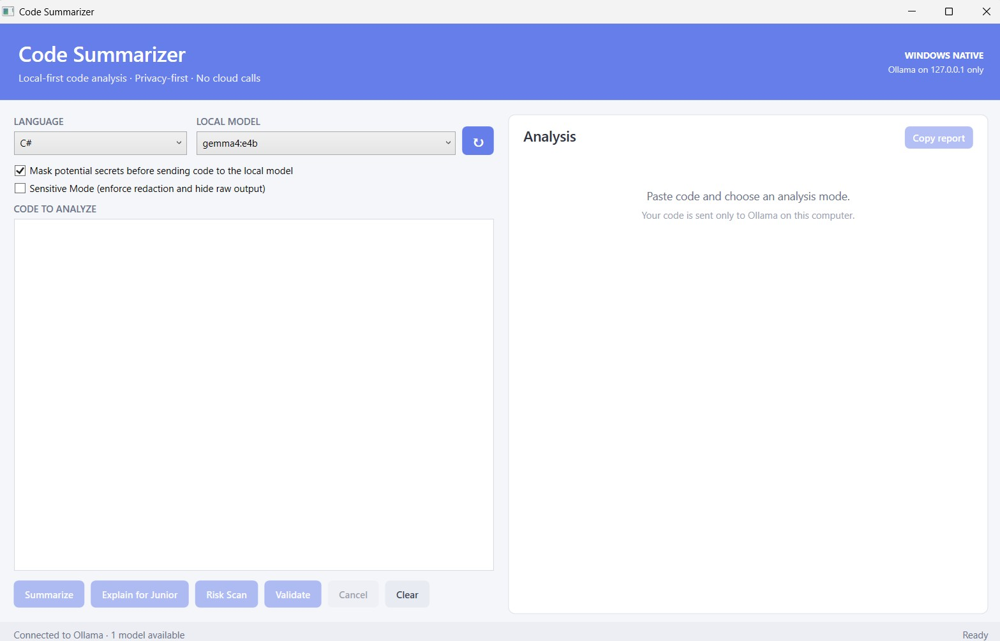
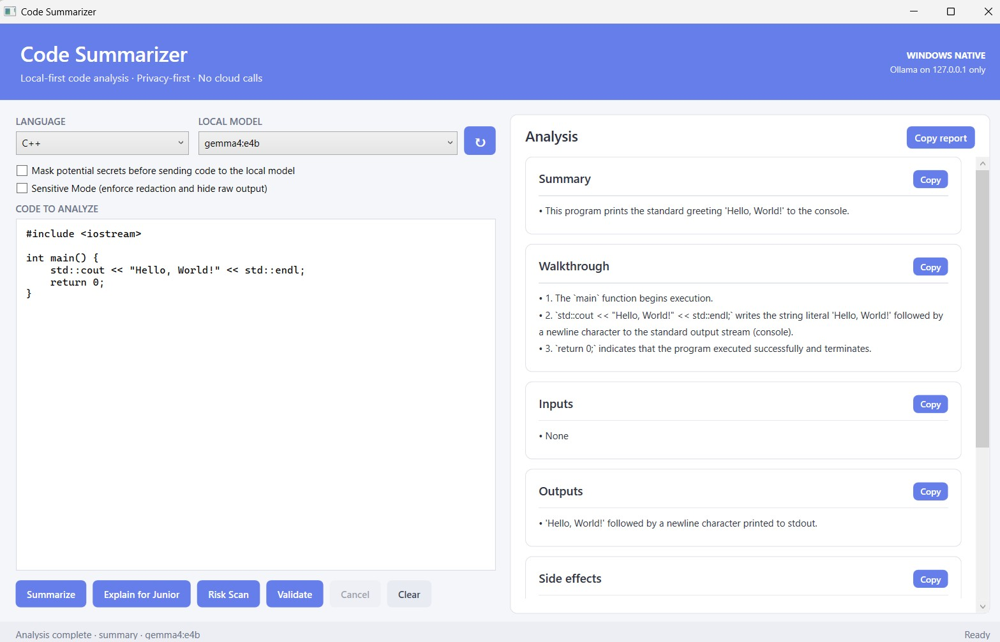

# Code Summarizer for Windows

Code Summarizer is a native Windows desktop application for understanding, reviewing,
and validating source-code snippets with a local Ollama model. The application is built
with C# and WPF on .NET 8 and is designed for local-first workflows where source code
must not be sent to an internet-hosted AI service.

The Windows application is self-contained: end users do not need to install .NET,
Python, Node.js, or Rust. Ollama and an approved local model remain separate requirements.

## Screenshots

### Connected workspace



### Structured code analysis



The screenshots show the general-purpose Windows profile. Restricted builds display
`RESTRICTED BUILD`, lock Sensitive Mode on, disable copy controls, and suppress raw output.

## What it does

Four analysis modes are available:

- **Summarize** — concise purpose, flow, inputs, outputs, and side effects.
- **Explain for Junior** — a detailed walkthrough using approachable language.
- **Risk Scan** — security and code-quality observations classified as high, medium, or low.
- **Validate** — model-guided syntax, type, and structural feedback with locations when available.

Results are parsed from structured JSON and displayed in separate Summary, Walkthrough,
Inputs, Outputs, Side Effects, Risks, Junior Explanation, and Confidence sections.

Validation is AI-guided. It does not replace a compiler, parser, language server, static
analyzer, or formal security review.

## Supported languages

ABAP, Ada, Assembly, Bash, C, C++, C#, COBOL, CSS, DAX, Delphi/Object Pascal,
Fortran, Go, Java, JavaScript, JSON, MATLAB, Pascal, PL/SQL, PowerShell, Python,
R, Rust, SAS, SQL, SystemVerilog, T-SQL, Terraform/HCL, TypeScript, VBA, VB.NET,
VHDL, Verilog, XML, and XSLT.

Language support supplies context to the selected model. It does not install or invoke
the corresponding compiler or toolchain.

## Security profiles

| Capability | General-purpose profile | Restricted assessment profile |
|---|---:|---:|
| Ollama endpoint fixed to `127.0.0.1:11434` | Yes | Yes |
| Secret detection and masking | User-controlled | Enforced |
| Sensitive Mode | User-controlled | Compile-time enforced |
| Raw model output | Optional display | Suppressed |
| App-provided clipboard export | Available outside Sensitive Mode | Disabled |
| Windows screen-capture exclusion | Active in Sensitive Mode | Required; analysis fails closed |
| Input and response safety limits | Yes | Yes |
| Build label | `WINDOWS NATIVE` | `RESTRICTED BUILD` |

The restricted profile is the default produced by `publish.ps1`. It is a hardened
assessment candidate—not an authorization to process classified information.

## Privacy and security properties

- Application network calls are limited to `http://127.0.0.1:11434`.
- No cloud AI API, telemetry client, analytics SDK, updater, account system, database,
  remote listener, or plugin loader is included.
- Pasted snippets and model results are not intentionally written to disk by the app.
- Common AWS, JWT, bearer, PEM, GitHub, Google, API, Azure storage, and assignment-style
  credentials are detected and can be redacted before prompt construction.
- Secret warnings use masked previews instead of detected values.
- Input, model-list, model-response, timeout, and displayed-error sizes are bounded.
- Model output is treated as untrusted data, parsed as JSON, and rendered as inert text.

Privacy depends on the complete endpoint. Windows paging, crash dumps, clipboard
features, endpoint monitoring, Ollama behavior, and model storage require separate review.
Regex secret detection is best effort and must not be treated as permission to paste
credentials or unnecessary sensitive data.

## Requirements

### End users

- Windows 10 or Windows 11, 64-bit
- [Ollama](https://ollama.com/) installed and running locally
- At least one locally installed model

Example model setup:

```powershell
ollama pull qwen2.5-coder:7b
ollama list
```

Use a smaller approved model when system RAM is limited. Organizations evaluating the
restricted build must approve Ollama and every model artifact separately.

### Developers

- Windows
- .NET SDK `9.0.312`, pinned by `global.json`
- .NET 8 runtime packs used for the self-contained target
- Optional: Inno Setup 6 for creating `Setup.exe`
- Optional: Windows SDK `signtool.exe` and an organization-approved certificate for signing

## Run from source

```powershell
dotnet build CodeSummarizer.Windows.csproj
dotnet run --project CodeSummarizer.Windows.csproj
```

The source-run configuration is the general-purpose profile. Start Ollama before opening
the app so the model list can be loaded.

## Test

The repository includes a dependency-free regression harness for redaction, secret
preview safety, prompt boundaries, supported-language context, structured parsing, and
the loopback endpoint policy.

```powershell
dotnet run --project tests\CodeSummarizer.Windows.Tests.csproj -c Release
```

Release builds run recommended .NET analyzers and treat warnings as errors.

## Publish

Create the default restricted, self-contained `win-x64` package:

```powershell
.\publish.ps1
```

Create the general-purpose package:

```powershell
.\publish.ps1 -GeneralPurpose
```

Create a restricted ARM64 package:

```powershell
.\publish.ps1 -Runtime win-arm64
```

Outputs are written under `artifacts` and include the portable ZIP plus a SHA-256 file.
When Inno Setup 6 is available, the script also creates a per-user installer. End users
do not need Inno Setup.

Signing can use a certificate already protected in the Windows certificate store:

```powershell
.\publish.ps1 -CertificateThumbprint "ORGANIZATION_CERTIFICATE_THUMBPRINT"
```

Do not store signing keys or certificate passwords in this repository.

## Audit evidence

Generate a fresh restricted build and evidence bundle:

```powershell
.\audit.ps1
```

The bundle contains:

- Security regression test results
- Git revision and tracked-tree state
- Binary and source SHA-256 manifests
- Restricted-build metadata and Authenticode status
- SPDX 2.3 component inventory
- Architecture, security, privacy, threat-model, deployment, and license documents

Begin an assessment with [AUDIT_READINESS.md](AUDIT_READINESS.md), then review
[SECURITY.md](SECURITY.md), [THREAT_MODEL.md](THREAT_MODEL.md), and
[DEPLOYMENT.md](DEPLOYMENT.md).

Operational government or classified deployment still requires organization-approved
signing, independent scanning and review, exact Ollama/model hashes, a hardened endpoint,
application allowlisting, selected controls, and an RMF/ATO or equivalent authorization.

## Architecture

```text
User snippet
  -> input-size policy
  -> secret scan and optional/enforced redaction
  -> mode-specific prompt construction
  -> Ollama at 127.0.0.1:11434
  -> bounded structured JSON response
  -> schema parsing
  -> inert local WPF display
```

The application has no third-party runtime NuGet packages. Its runtime components are
the self-contained Microsoft .NET 8 Windows Desktop Runtime, Windows APIs, and the
separately installed Ollama/model stack. See [ARCHITECTURE.md](ARCHITECTURE.md) for the
security boundary and data flow.

## Repository layout

```text
Models/                 Structured analysis and secret-finding types
Services/               Ollama, prompts, parsing, redaction, and security policy
ViewModels/             WPF presentation state and commands
tests/                  Dependency-free security regression harness
MainWindow.xaml         Native Windows interface
publish.ps1             Self-contained packaging and optional signing
audit.ps1               Audit evidence and SPDX generation
installer.iss           Optional Inno Setup definition
```

## Documentation

- [Architecture](ARCHITECTURE.md)
- [Audit readiness](AUDIT_READINESS.md)
- [Restricted deployment guide](DEPLOYMENT.md)
- [Privacy and data handling](PRIVACY.md)
- [Security policy](SECURITY.md)
- [Threat model](THREAT_MODEL.md)

## License

Code Summarizer for Windows is licensed under GPL-3.0-or-later. See [LICENSE](LICENSE).
